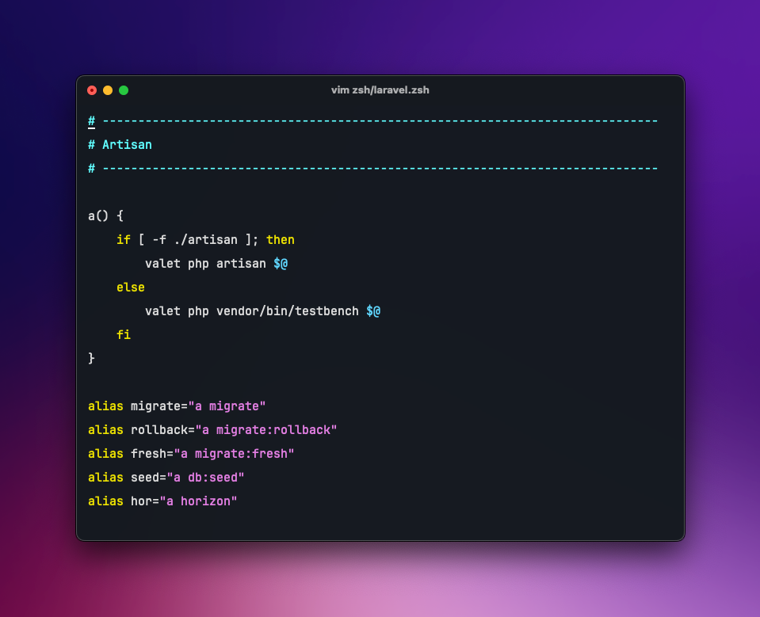
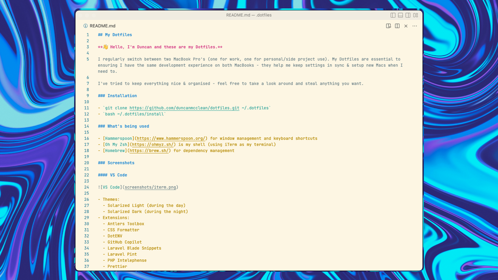

## My Dotfiles

**👋 Hello, I'm Duncan and these are my Dotfiles.**

I regularly switch between two MacBook Pro's (one for work, one for personal/side project use). My Dotfiles are essential to ensuring I have the same development experience on both MacBooks - they help me keep settings in sync & setup new Macs when I need to.

I've tried to keep everything nice & organised - feel free to take a look around and steal anything you want.

### Installation

- `git clone https://github.com/duncanmcclean/dotfiles.git ~/.dotfiles`
- `bash ~/.dotfiles/install`

### What's being used

- [Hammerspoon](https://www.hammerspoon.org/) for window management and keyboard shortcuts
- [Oh My Zsh](https://ohmyz.sh/) is my shell (using iTerm as my terminal)
- [Homebrew](https://brew.sh/) for dependency management

### Screenshots

#### VS Code

- Theme: Ayu Dark

#### iTerm & Oh My Zsh

- iTerm Theme: Dark Background
- Oh My Zsh Theme: Bubblegum

### Things to look into

- Dotbot
- [zsh-autosuggestions](https://github.com/zsh-users/zsh-autosuggestions)
- [zsh-syntax-highlighting](https://github.com/zsh-users/zsh-syntax-highlighting)
- Laravel Pint in VS Code (instead of PHP CS Fixer)

### Inspiration

- [Jesse Leite's Dotfiles](https://github.com/jesseleite/dotfiles)
- [Dries Vints' Dotfiles](https://github.com/driesvints/dotfiles)
